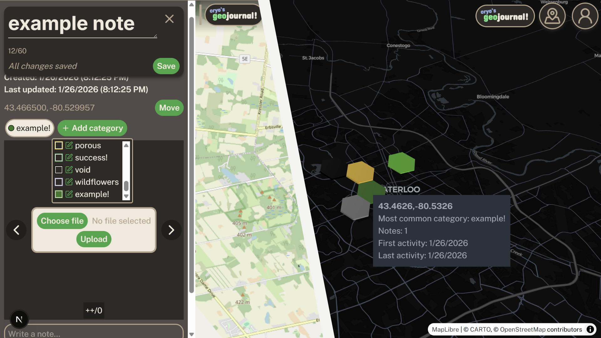
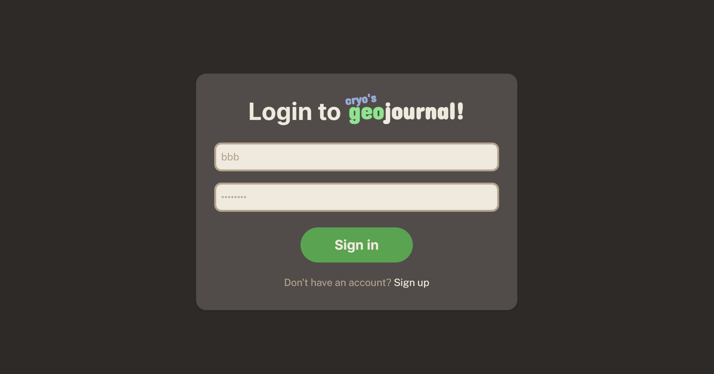
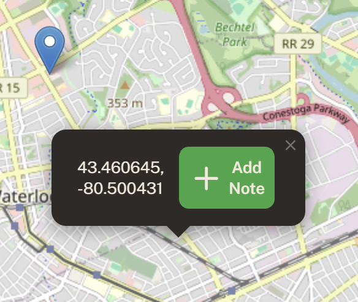
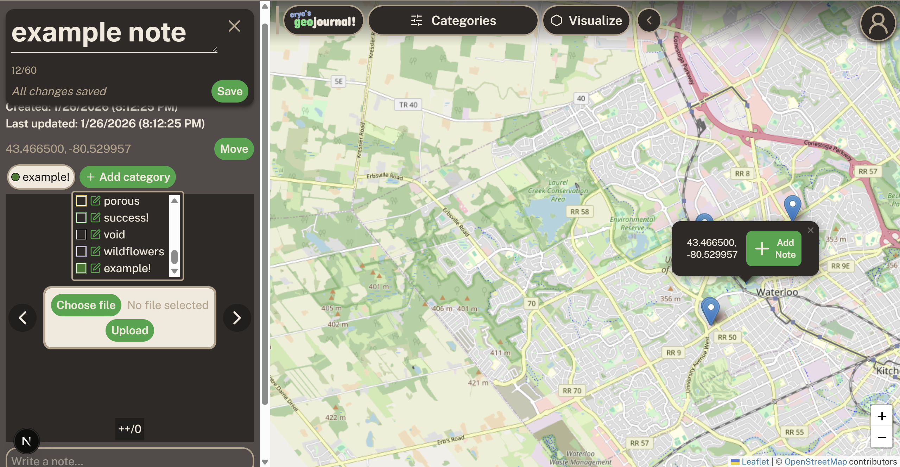
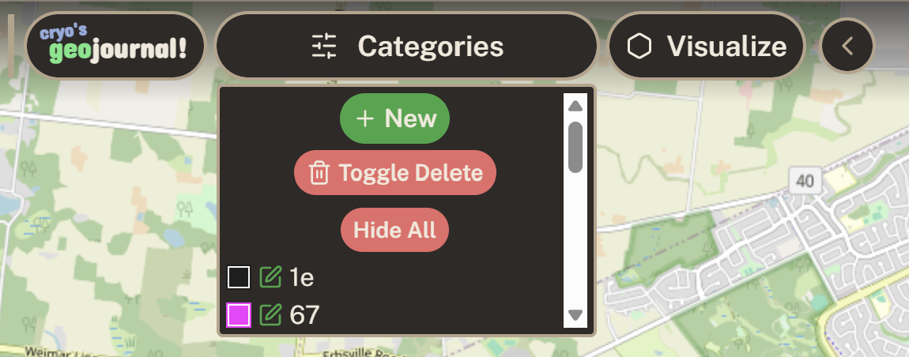
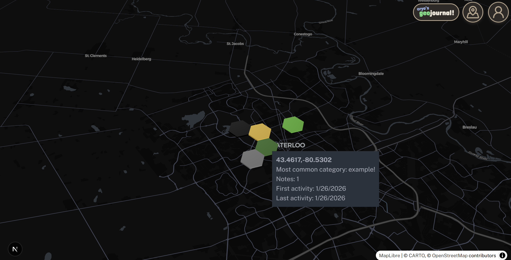
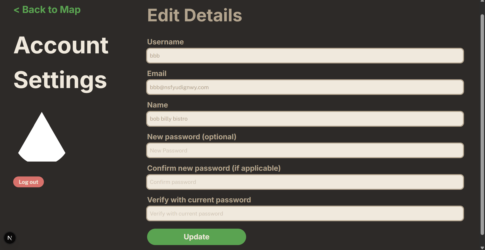

<!-- ABOUT THE PROJECT -->
# geojournal!
***geojournal!*** is an interactive map-based journaling webapp, allowing users to create and edit geotagged notes and explore their notetaking patterns with modern geo-data visualization libraries. 


<!-- FEATURES -->
## Features
- **Geotagged journal notes:**
	- Create and edit notes with a click anywhere on the map
	- Add descriptions, images, and categories to your notes
- **Custom categories:**
	- Create, edit, and delete your own custom categories with custom colors
	- Notes can be assigned multiple categories or none at all!
- **Visualize notes data:**
	- Notes are grouped into hexagonal cells (using H3), each displaying an analysis of your note activity patterns in that area.
	- Visual encodings:
		-   **Color** represents the dominant category in each area
		-   **Height** represents the number of notes
		-   **Opacity** reflects recency of activity
	- Visualization updates as notes change!
- **Secure authentication:**
	- Authentication built with latest Auth.js versions integrated with Next.js
	- Usage of JWTs, and passwords are salted and hashed
	- CRUD APIs automatically check for authentication and only process/return data accessible by the current user

<!-- BUILT WITH -->
## Built With
- **Full-stack framework:** Next.js with Typescript
- **Frontend:** React / Tailwind CSS
- **Mapping and visualization:** Leaflet, Maplibre GL JS, deck.gl
-  **Database:** MongoDB, Mongoose
- **Image cloud:** ImageKit.io

<p align="right">(<a href="#readme-top">back to top</a>)</p>

<!-- PROJECT SETUP -->
## Accessing the App

Currently working on deploying a web demo, but this project is available for installation.

### Installation
1. Clone the repo
   ```sh
   git clone https://github.com/cryolins/geojournal.git
   ```
 2. Verify that you are in the geojournal directory
    ```sh
	cd geojournal
	   ```
3. Install NPM packages
   ```sh
   npm install
   ```
4. Copy `.env.example` as `.env` and fill in the fields
   ```py
   # mongoDB uri, either a mongoDB cloud uri or local port
   MONGODB_URI=""
   # generate a nextauth secret by running: openssl rand -base64 32
   NEXTAUTH_SECRET=""
   NEXTAUTH_URL="http://localhost:3000" # default run port
   # setup an imagekit account and retrieve the private key
   IMAGEKIT_PRIVATE_KEY=""
   # setup an imagekit account and retrieve the public key
   IMAGEKIT_PUBLIC_KEY=""
   ```

### Running the app
Run `npm run dev` in the `geojournal` directory

<p align="right">(<a href="#readme-top">back to top</a>)</p>

<!-- USAGE EXAMPLES -->
## Usage
- Navigate to the `/signup` page to create an account, or `/login` to log in to an account


- You will be redirected to the `/map` page where you can create a new note by clicking on the map, then you will be able to create and save the note



- The Categories button in the map navbar allows you to manage your categories and filter what categories of notes are shown on the map


- The Visualize button in the map navbar directs you to the visualizer page, allowing for an interactive map view of statistics of your notes. Works better the more notes you have!


- You can change your account details by navigating to `/settings` via the user icon buttons. Be sure to enter your old password to confirm changes! (Profile pictures are coming soon)


<p align="right">(<a href="#readme-top">back to top</a>)</p>

<!-- ROADMAP -->
## Roadmap

- [ ] Profile Pictures
- [ ] Deploying a demo
- [ ] Add OAuth options, along with auth features like forgot password.

<!-- LICENSE -->
## License

Distributed under the MIT License. See `LICENSE.txt` for more information.

<!-- REPO INFO -->
## Repository Info

By: [cryolins](https://github.com/cryolins)

Project Link: [https://github.com/cryolins/geojournal](https://github.com/cryolins/geojournal)

<!-- ACKNOWLEDGMENTS -->
## Acknowledgments

Here are some smaller useful libraries used in this project!

* [React Icons](https://react-icons.github.io/react-icons/search)
* [Zod (for API validation)](https://zod.dev/)

<p align="right">(<a href="#readme-top">back to top</a>)</p>


<!-- MARKDOWN VARIABLES -->
<!-- https://www.markdownguide.org/basic-syntax/#reference-style-links -->
